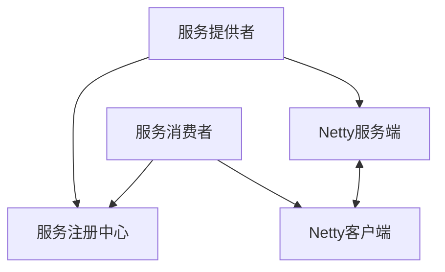
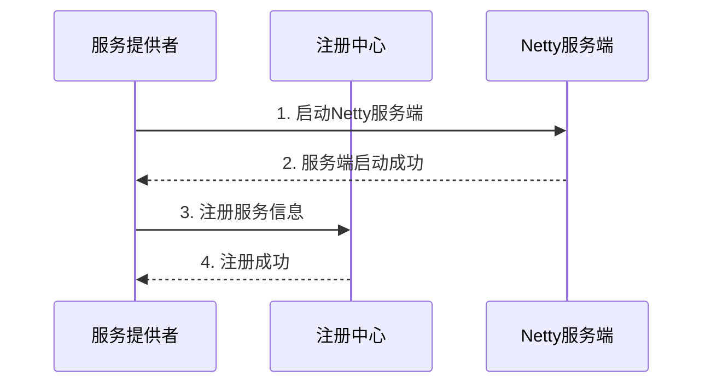
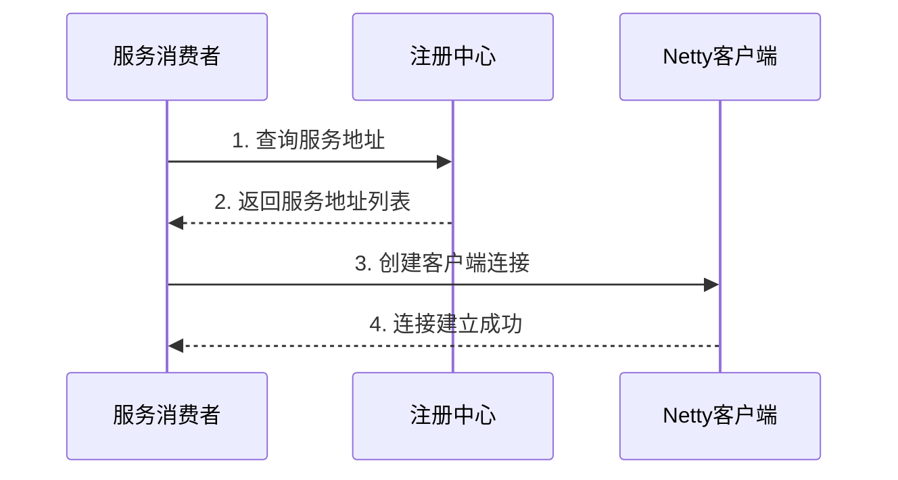
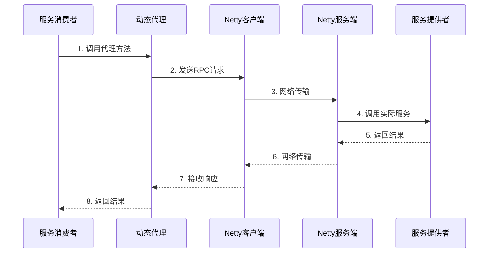
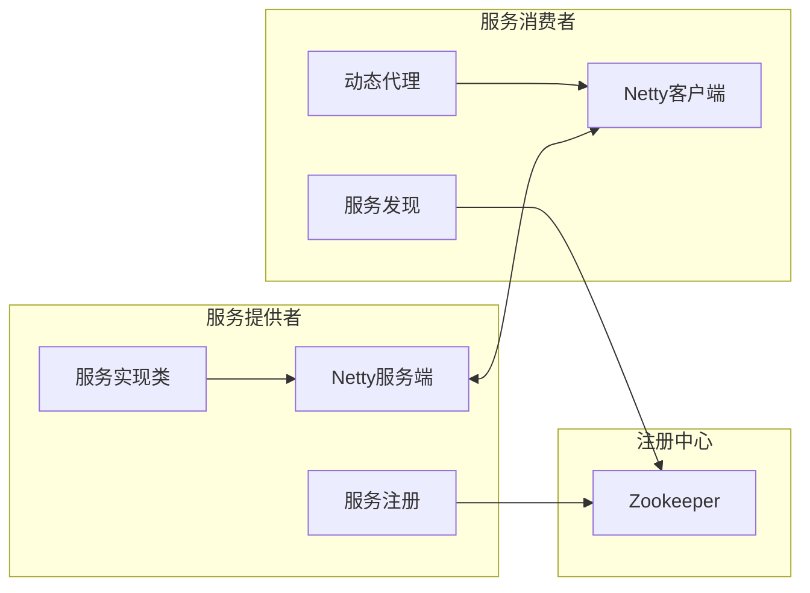
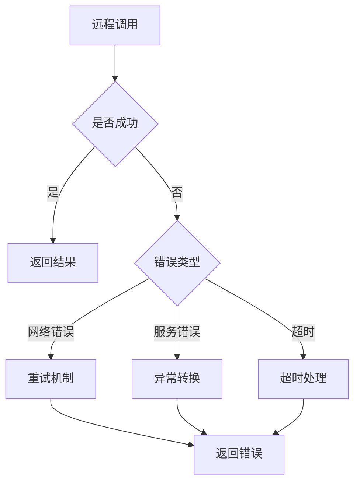
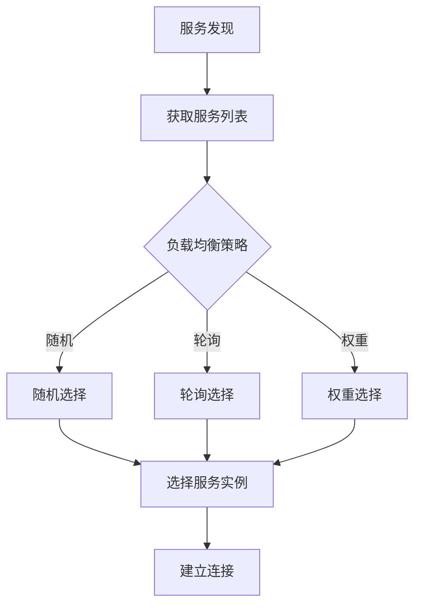
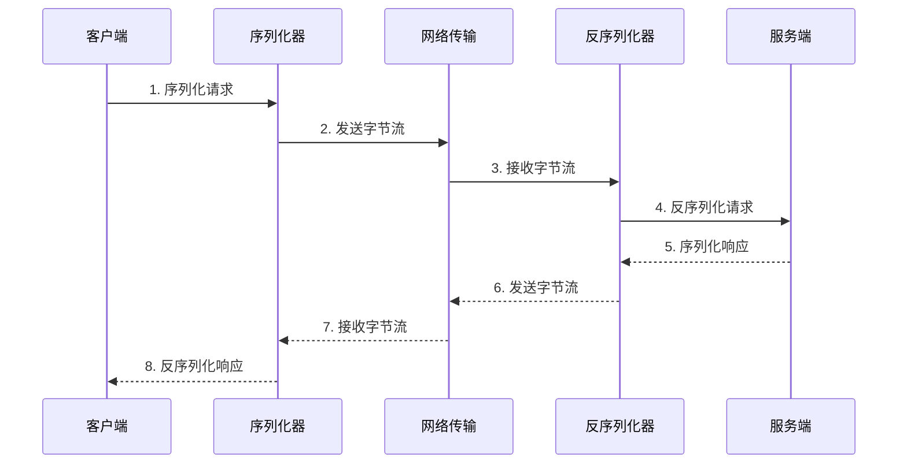

# RPC框架流程图

## 1. 整体架构图

## 2. 服务注册流程

## 3. 服务发现流程

## 4. 远程调用流程

## 5. 组件交互图

## 6. 异常处理流程

## 7. 负载均衡流程

## 8. 序列化流程

这些流程图展示了RPC框架的各个关键流程，包括：

1. 整体架构
2. 服务注册
3. 服务发现
4. 远程调用
5. 组件交互
6. 异常处理
7. 负载均衡
8. 序列化过程

通过这些流程图，可以更直观地理解RPC框架的工作原理和各个组件之间的交互关系。 
